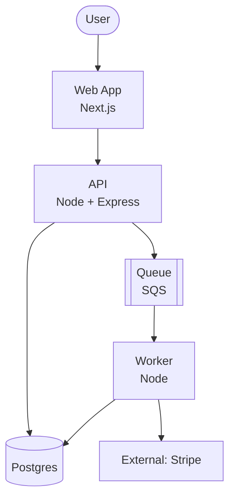

# architecture-diagrams

The pipeline standardizes on one diagram style so engineers don't have to debate it. **C4 levels + Mermaid + Markdown.** That's it. If you need a diagram that doesn't fit, ask the user — don't invent a new convention.

## Where diagrams live

`docs/diagrams/<slug>.md`

Each file is one diagram with one Mermaid block and a short caption.

## C4 levels — when to use which

- **Level 1: System Context.** Show this system as a single box, plus the actors and external systems it touches. Use when onboarding a new contributor or explaining "what is this thing".
- **Level 2: Containers.** Show the deployable units (web app, API, worker, DB, cache). Default level for `docs/diagrams/`.
- **Level 3: Components.** Show internal components of one container. Use sparingly — usually only when a specific module is complex enough to need its own diagram.
- **Level 4: Code.** Don't. The code is the diagram. If you need this, write code, not Mermaid.

Default to Level 2 unless the user asks otherwise.

## Mermaid template — Container diagram

```markdown
# <System> — containers



Caption: <one paragraph explaining the boundaries and data flow>
```

## Conventions

- Use `[]` for containers, `[()]` for stores, `[[]]` for queues, `([])` for actors, `{{}}` for external systems.
- Label each edge if the protocol matters (HTTP, gRPC, event, file).
- Don't draw every internal class. C4 Level 4 belongs in code, not diagrams.
- Keep arrows directional and meaningful. If everything points to everything, the diagram is wrong.

## Anti-patterns

- Diagrams that show one giant cloud labelled "AWS". Show the specific services.
- Diagrams that include every Lambda by name. Group them by domain.
- Diagrams without a caption. The caption is what the reader actually reads.
