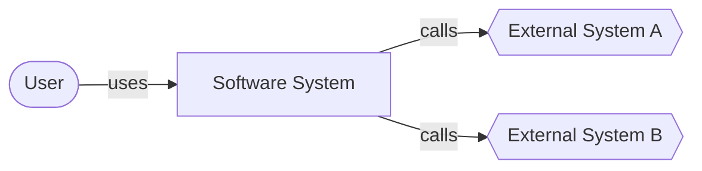
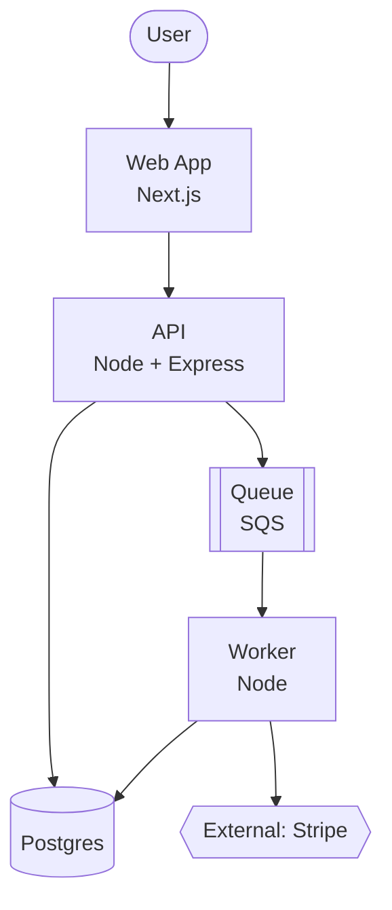
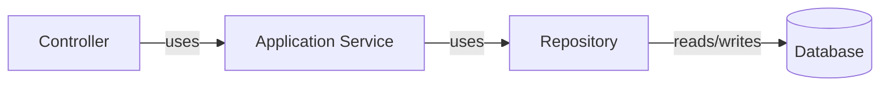
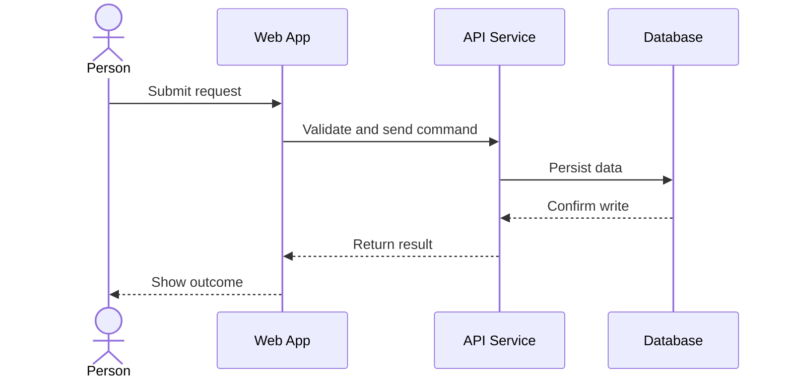
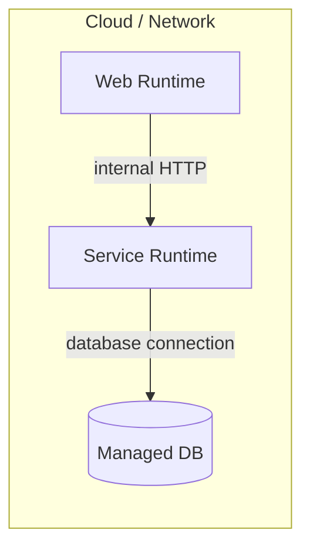

# architecture-diagrams

The pipeline standardizes on one diagram style so engineers don't have to debate it. **C4 levels + Mermaid + Markdown.** That's it. If you need a diagram that doesn't fit, ask the user — don't invent a new convention.

## Where diagrams live

`docs/diagrams/<slug>.md`

Each file is one diagram with one Mermaid block and a short caption.

## C4 levels — when to use which

- **Level 1: System Context.** Show this system as a single box, plus the actors and external systems it touches. Use when onboarding a new contributor or explaining "what is this thing".
- **Level 2: Containers.** Show the deployable units (web app, API, worker, DB, cache). Default level for `docs/diagrams/`.
- **Level 3: Components.** Show internal components of one container. Use sparingly — usually only when a specific module is complex enough to need its own diagram.
- **Level 4: Code.** Don't. The code is the diagram. If you need this, write code, not Mermaid.

Plus two non-C4 diagrams that earn their place in real codebases:

- **Dynamic (sequence).** Show a request, event, or workflow over time. Use when the question is "what happens in what order", not "what talks to what".
- **Deployment.** Show infrastructure nodes, networks, and runtime placement. Use when ops boundaries matter.

Default to Level 2 unless the user asks otherwise.

## Output rules

- Use plain Mermaid `flowchart` or `sequenceDiagram` syntax. Not C4-specific Mermaid (no `C4Context` blocks) — plain is more portable and renders everywhere.
- Use `[]` for containers, `[()]` for stores, `[[]]` for queues, `([])` for actors, `{{}}` for external systems.
- Label each edge if the protocol or intent matters (HTTP, gRPC, event, file).
- Keep arrows directional and meaningful. If everything points to everything, the diagram is wrong.
- Don't mix levels accidentally. Containers are runnable units; components live inside one container.
- Every diagram gets a one-paragraph caption. The caption is what the reader actually reads.

## Templates

Each template shows the contents of one file in `docs/diagrams/`. Use a four-backtick fence in the outer file only if you need to nest example markdown; the diagrams themselves use plain three-backtick `mermaid` fences.

### Level 1 — System Context

Caption: one paragraph — what the system is, who uses it, what it depends on.

### Level 2 — Containers (default)

Caption: one paragraph explaining the boundaries and data flow.

### Level 3 — Components (one container)

Caption: one paragraph — which container this expands, why it's worth showing.

### Dynamic — sequence

Caption: one paragraph — which user flow this is, what's load-bearing about the ordering.

### Deployment

Caption: one paragraph — where this runs, what's managed vs self-hosted, what crosses a network boundary.

## Common Mistakes

| Mistake | Fix |
| --- | --- |
| Drawing all C4 levels for every system | Draw only the levels that answer the current question. Default to Level 2. |
| Treating modules as containers | Containers are runnable / deployable units. Modules are usually components. |
| Mermaid `C4Context` / `C4Container` blocks | Use plain `flowchart` / `sequenceDiagram` — more portable, renders everywhere. |
| One giant cloud labelled "AWS" | Show specific services (Lambda, RDS, S3). |
| Listing every Lambda by name | Group by domain. The diagram is a map, not a phone book. |
| No caption | The caption is what readers read. Always include one. |
| Mixing levels accidentally | One diagram, one level. Components live inside one container; don't show containers and their internals in the same picture. |
| Hiding uncertainty | If a boundary or dependency is unknown, label it as such or note it in the caption — don't draw a confident line where one doesn't exist. |
