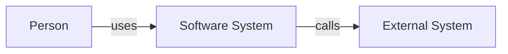
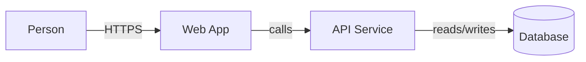
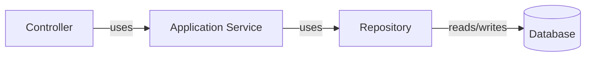
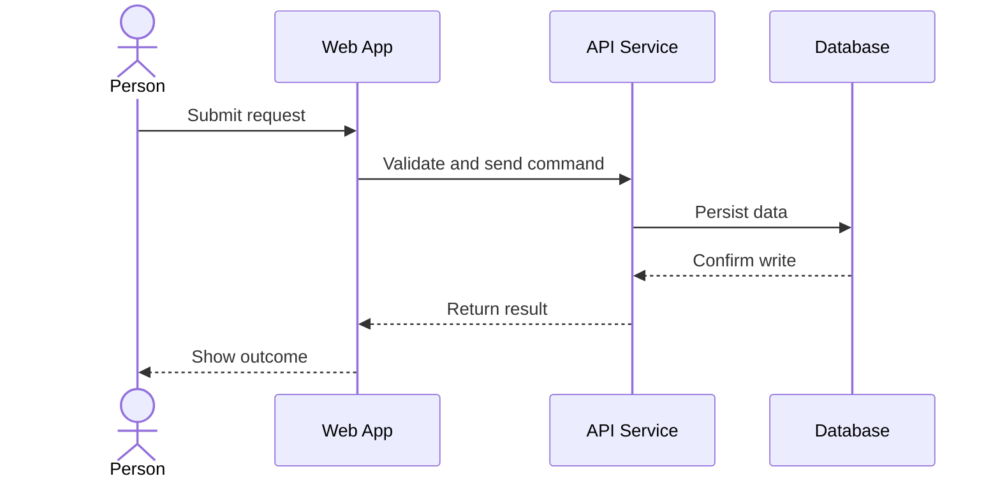
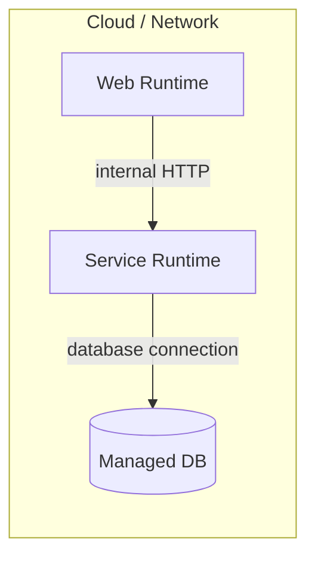

# Architecture Diagram Templates

Use these as starting points. Replace generic labels with domain names from the codebase or proposed system. All diagrams use plain Mermaid (`flowchart` or `sequenceDiagram`), not C4-specific Mermaid syntax.

## System Context (Level 1)

## Container (Level 2)

## Component (Level 3)

Container: API Service

## Dynamic (sequence)

## Deployment

